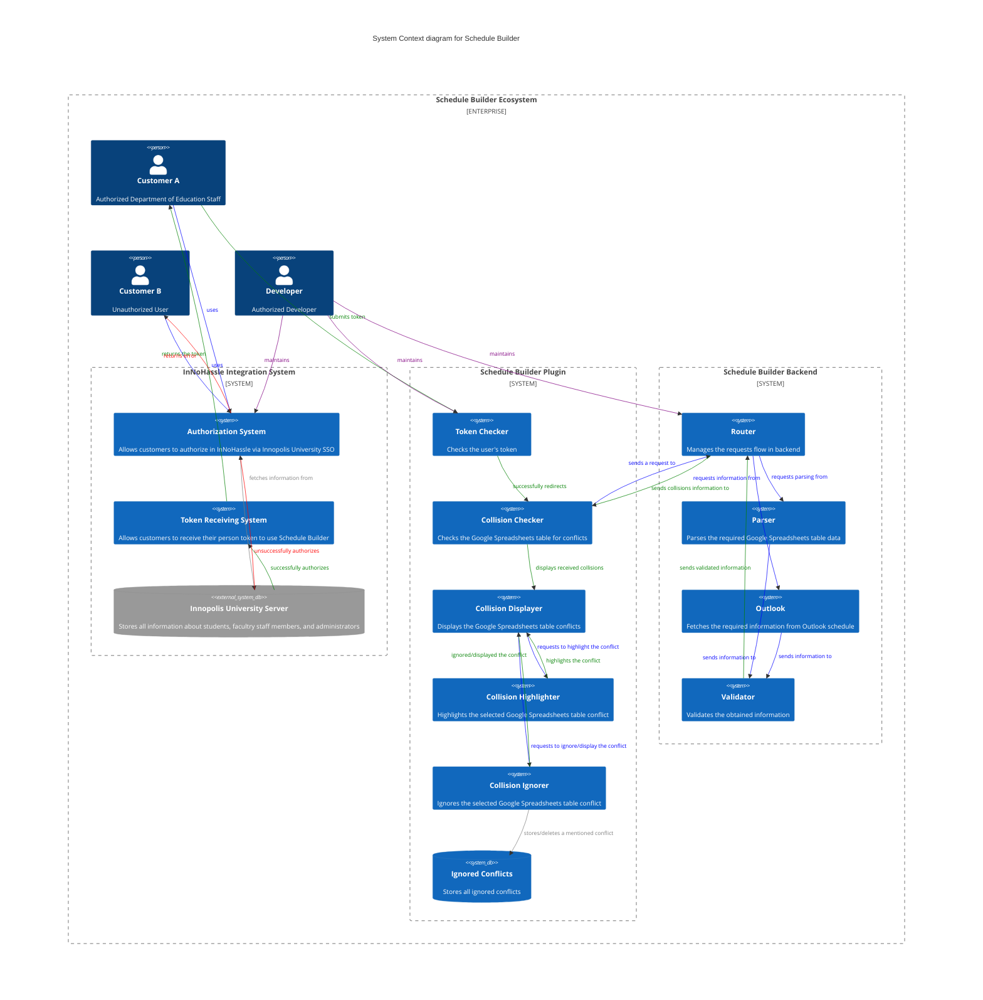

[![Contributors][contributors-shield]][contributors-url]
[![Forks][forks-shield]][forks-url]
[![Stargazers][stars-shield]][stars-url]
[![Issues][issues-shield]][issues-url]
[![project_license][license-shield]][license-url]
[![commits][commit-shield]][commit-url]

<!-- PROJECT LOGO -->
<br />
<div align="center">
  <a href="https://github.com/SWP2025/schedule-builder-backend">
    
  </a>

<h3 align="center">Schedule Builder</h3>

  <p align="center">
    Schedule Builder is created as a tool for Innopolis University Department of Education (DoE) to assist the department in efficient creation of high-quality curriculums for bachelors, masters, and PhD students without any conflicts.
    <br />
    <a href="https://docs.google.com/spreadsheets/d/1amQqvE0rfU92pfMsMnUKA-lTGjlcJ-Sv5UcPpGnxW4w/edit?gid=558406858#gid=558406858">Demo Website</a>
    &middot;
    <a href="https://github.com/SWP2025/schedule-builder-backend/issues/new?template=bug-report-template.md">Report Bug</a>
    &middot;
    <a href="https://github.com/SWP2025/schedule-builder-backend/issues/new?template=technical-task-template.md">Request Feature</a>
    &middot;
    <a href="https://disk.yandex.ru/i/31xWqPXMcE1HCw">Demo Video</a>
  </p>
</div>

## About Us
#### Project Goal
Our key goal is to simplify the process of schedule creation and correction for Innopolis University DoE.
#### Project Description
Schedule Builder is a Google Spreadsheets plugin. The plugin is opened in parallel with the schedule and launched to check
the table for conflicts. Upon successful fetching, the user receives a list of conflicts found by the plugin. To simplify
the navigation, conflicts may be **highlighted** (user's cursor is moved to the conflicting cell) and **ignored** (conflict is
hidden from the user's view). The user may repeat scanning until all conflicts are resolved.
## Context Diagram

## Roadmap

- [x] **MVP v0**
- [x] **MVP v1** 
  - [x] Plugin Creation
  - [x] Teacher Conflicts handling
  - [x] Capacity Conflicts handling
- [x] **MVP v1.5**
  - [x] Integration Tests
  - [x] Unit Tests
- [x] **MVP v2**
  - [x] Improved parser functionality
  - [x] Additional Integration Tests
  - [x] Additional Unit Tests
- [ ] **MVP v3**
  - [ ] Automatic Collisions Fixing
  - [ ] Staff Preferences

See the [open issues](https://github.com/SWP2025/schedule-builder-backend/issues) for a full list of proposed features (and known issues).
## Testing User Guide
To test our product, you may follow the deploy link to Google Spreadsheets table with deployed plugin in it. In the plugin, you will be firstly required to visit the special page
of InNoHassle and obtain your requests token. Paste the token in the special field
and click the schedule checking button. After collisions fetching, you may navigate through
them and take actions in the table. 
## How to Install?
### Development setup
1. Install [Python 3.12+](https://www.python.org/downloads/), [uv](https://docs.astral.sh/uv/), [Docker](https://docs.docker.com/engine/install/).
2. Install project dependencies with [uv](https://docs.astral.sh/uv/cli/#install).
   ```bash
   uv sync
   ```
3. Copy settings.example.yaml to settings.yaml and add token:
   ```bash
   cp settings.example.yaml settings.yaml 
   ```
5. Start development server:
   ```bash
   uv run uvicorn src.presentation.app:app --port=8000 --host=0.0.0.0 --reload
   ```
   > Follow the provided instructions (if needed).
6. Open the following link the browser: http://localhost:8000.
   > The API will be reloaded when you edit the code.

> [!IMPORTANT]
> For endpoints requiring authorization, click "Authorize" button in Swagger UI!

> [!TIP]
> Edit `settings.yaml` according to your needs, you can view schema in [settings.schema.yaml](settings.schema.yaml).

### Deployment
We use Docker with Docker Compose plugin to run the service on servers.

1. Copy the file with settings: `cp settings.example.yaml settings.yaml`.
2. Change settings in the `settings.yaml` file according to your needs
   (check [settings.schema.yaml](settings.schema.yaml) for more info).
3. Install Docker with Docker Compose.
4. Build and run docker container: `docker compose up --build`.

### Dependencies updates
1. Run `uv sync -U` to update all dependencies.
2. Run `uv pip list --outdated` to check for outdated dependencies.

## Documentation
`.` \
`├── Quality characteristics and attribute scenarios` **[here](https://github.com/SWP2025/schedule-builder-backend/tree/main/docs/quality-attributes/quality-attribute-scenarios.md)** \
`├── Architecture` \
`│   ├── Static view` **[here](https://github.com/SWP2025/schedule-builder-backend/tree/main/docs/architecture/static-view/static-view.md)** \
`│   ├── Dynamic view` **[here](https://github.com/SWP2025/schedule-builder-backend/tree/main/docs/architecture/dynamic-view/dynamic-view.md)** \
`│   └── Deployment view` **[here](https://github.com/SWP2025/schedule-builder-backend/tree/main/docs/architecture/deployment-view/deployment-view.md)** \
`├── Quality assurance` \
`│   ├── Automated tests` **[here](https://github.com/SWP2025/schedule-builder-backend/tree/main/docs/quality-assurance/automated-tests.md)** \
`│   └── User acceptance tests` **[here](https://github.com/SWP2025/schedule-builder-backend/tree/main/docs/quality-assurance/user-acceptance-tests.md)** \
`├── Build and deployment automation` \
`│   ├── Continuous Integration` **[here](https://github.com/SWP2025/schedule-builder-backend/tree/main/docs/automation/continuous-integration.md)** \
`│   └── Continuous Deployment` **[here](https://github.com/SWP2025/schedule-builder-backend/tree/main/docs/automation/continuous-delivery.md)** \
`└── Development` **[here](https://github.com/SWP2025/schedule-builder-backend/tree/main/CONTRIBUTING.md)**

## Project Structure Tree (for customer)
The project structure tree is important to properly navigate the project and enhance simplified third-party
contributions.

```
.
├── CHANGELOG.md
├── CONTRIBUTING.md
├── Dockerfile
├── LICENSE
├── README.md
├── bin
│   └── git-cliff
├── docker-compose-prod.yml
├── docker-compose.yml
├── docs
│   ├── architecture
│   │   ├── architecture.md
│   │   ├── deployment-view
│   │   │   └── ...
│   │   ├── dynamic-view
│   │   │   └── ...
│   │   └── static-view
│   │       └── ...
│   ├── automation
│   │   └── ...
│   ├── development
│   │   └── ...
│   ├── images
│   │   └── ...
│   ├── quality-assurance
│   │   └── ...
│   └── quality-attributes
│       └── ...
├── entrypoint.sh
├── git-cliff-2.7.0
│   └── ...
├── git-cliff-2.7.0-x86_64-unknown-linux-gnu.tar.gz
├── nginx.conf
├── pyproject.toml
├── rooms.yaml
├── scripts
│   └── ...
├── settings.example.yaml
├── settings.schema.yaml
├── src
│   ├── application
│   │   ├── ...
│   │   ├── external_api
│   │   │   └── innohassle
│   │   │       └── interfaces
│   │   │           └── ...
│   │   └── use_cases
│   │       └── ...
│   ├── ...
│   ├── domain
│   │   ├── ...
│   │   ├── dtos
│   │   │   └── ...
│   │   ├── exceptions
│   │   │   └── ...
│   │   └── interfaces
│   │       ├── ...
│   │       ├── services
│   │       │   └── ...
│   │       └── use_cases
│   │           └── ...
│   ├── infrastructure
│   │   ├── external_api
│   │   │   └── innohassle
│   │   │       └── ...
│   │   └── services
│   │       └── ...
│   ├── parsers
│   │   ├── ...
│   │   ├── core_courses
│   │   │   └── ...
│   │   └── processors
│   │       └── ...
│   └── presentation
│       ├── ...
│       ├── dependencies
│       │   ├── ...
│       │   ├── external_api
│       │   │   └── innohassle
│       │   │       └── ...
│       │   ├── services
│       │   │   └── ...
│       │   └── use_cases
│       │       └── ...
│       └── routes
│           └── ...
├── teachers.yaml
├── tests
│   ├── __init__.py
│   ├── fixtures
│   │   └── ...
│   ├── integration
│   │   └── ...
│   ├── mocks
│   │   └── ...
│   └── unit
│       ├── ...
│       └── collisions
│           └── ...
└── uv.lock
```

## Contributions Guide (for customer)

A contributions guide is important to help collaborators with default contribution
steps.

### How can I contribute?

There are multiple ways how you can help:

- 🐞 **Report a bug or request a feature**<br/>Go to the related repository and create a new issue for the bug/feature (go to `Issues` → `New Issue`).
- 🧑🏻‍💻 **Write code**<br/>Pick up an issue from [the board](https://github.com/orgs/SWP2025/projects/1) and continue reading this guide, if you want to send a pull request to one of our repositories.

### Sending Pull Request

Use English language everywhere on GitHub: in the code, comments, documentation, issues, PRs.

<details>
<summary>Why?</summary>

<br/>Most of us are Russian-speaking and we love Russian (🤍💙❤️), though we believe there are benefits of using English here:

1. **Bigger community:** there are many non-Russian speaking students studying and living in Innopolis, and everyone should be able to contribute.
2. **Open-source:** contributing to the global open-source community today is the crucial part of becoming a professional software engineer, and it's easier to so, if you use English.
3. Finally, practicing a foreign language has many benefits by itself (boosting brain activity, career benefits, etc.).
</details>

### Before you start

**For features:** before you start to work on a new feature, it's better to open a feature request issue first to discuss with the maintainers and other contributors whether the features is desired and decide on its design.
This can save time for everyone and help features to be deliveried faster.

**For small changes:** it's better to batch multiple typo fixes and small refactoring changes into one pull request to keep the commit history clean.

### Commit convention

We follow [Conventional Commits](https://www.conventionalcommits.org/) for commit messages, which allows the changelogs to be auto-generated.
Please read the guide if you aren't familiar with it already.

Note that `fix` and `feat` commit types are for **actual code changes that affect logic**.
If your commit changes docs or fixes typos, use `docs` or `chore` instead:

- <s>`fix: typo`</s> → `docs: fix typo`

### Creating pull request

> If you have troubles creating a pull request, [this guide](https://docs.github.com/en/pull-requests/collaborating-with-pull-requests/proposing-changes-to-your-work-with-pull-requests/creating-a-pull-request) might help.

It's ok to have multiple commits in a single PR, you don't need to rebase or force push anything, because we will `Squash and Merge` the PR into one commit.

**Title**

Your title should also follow the Conventional Commits. An example of a good PR title would be:

```
feat: add animated snowfall background
```

**Description**

Make sure your PR have a clear description of the changes made and the reason behind them.
If your PR closes an existing issue (e.g. #123), make sure to mention it using [built-in GitHub functionality](https://docs.github.com/en/issues/tracking-your-work-with-issues/linking-a-pull-request-to-an-issue#linking-a-pull-request-to-an-issue-using-a-keyword), so it will be automatically closed once the PR gets merged:

```markdown
...

Fixes #123.
```


<!-- MARKDOWN LINKS & IMAGES -->
<!-- https://www.markdownguide.org/basic-syntax/#reference-style-links -->
[contributors-shield]: https://img.shields.io/github/contributors/SWP2025/schedule-builder-backend.svg?style=for-the-badge
[contributors-url]: https://github.com/SWP2025/schedule-builder-backend/graphs/contributors
[forks-shield]: https://img.shields.io/github/forks/SWP2025/schedule-builder-backend.svg?style=for-the-badge
[forks-url]: https://github.com/SWP2025/schedule-builder-backend/network/members
[stars-shield]: https://img.shields.io/github/stars/SWP2025/schedule-builder-backend.svg?style=for-the-badge
[stars-url]: https://github.com/SWP2025/schedule-builder-backend/stargazers
[issues-shield]: https://img.shields.io/github/issues/SWP2025/schedule-builder-backend.svg?style=for-the-badge
[issues-url]: https://github.com/SWP2025/schedule-builder-backend/issues
[license-shield]: https://img.shields.io/github/license/SWP2025/schedule-builder-backend.svg?style=for-the-badge
[license-url]: https://github.com/SWP2025/schedule-builder-backend/blob/master/LICENSE
[product-screenshot]: images/screenshot.png
[commit-shield]: https://img.shields.io/github/commit-activity/t/SWP2025/schedule-builder-backend.svg?style=for-the-badge
[commit-url]: https://github.com/SWP2025
