# Schedule Builder
## Usage
Explain how to use your MVP v2. Provide information for access if needed, for example authentication credentials and so on. Make sure the customer and TA can launch/access and inspect your product after following the instructions in that section.

## Architecture
### Static view
Document the static view on your architecture using UML Component diagram, comment on the coupling and cohesion of your codebase, and discuss how 
your design decisions affect the maintainability of your product. 

### Dynamic view
Document the dynamic view of your architecture using UML Sequence diagram for a non-trivial request that showcases your system. The request 
must involve several components and multiple transactions between the components. 

Test and report how much time this scenario takes to 
execute in your production environment.
### Deployment view
Document the deployment view of your architecture (can be a custom view with
a legend), comment on the deployment choices and how it is to be deployed on the customer’s side. 

## Development
### Kanban Board
The project's Kanban board is organized in the following way:

| Board column | Entry criteria                                                                                                                                                                                                              |
|--------------|-----------------------------------------------------------------------------------------------------------------------------------------------------------------------------------------------------------------------------|
| Backlog      | A task is accepted to Backlog if:<br/>- it has been mentioned during the Customer Review,<br/>- the significance of the task has been discovered during the sprint.                                                         |
| Todo         | A task is accepted to Todo, if it is assigned to the current sprint and has to be completed by the deadline of the current sprint.                                                                                          |
| In Progress  | A task is accepted to In Progress, if the task is assigned to the current sprint and the task completion has already been started.                                                                                          |
| In Review    | A task is accepted to In Review, if the task was completed. This way, fellow team members can review the solution and provide useful feedback.                                                                              |
| Done         | A task is accepted to Done, if it satisfies the project's Definition of Done: the issue is finished (in terms of programming), deployed to the production, and is accordingly tested, thus verified in efficient execution. |
### Git Workflow
In the project, we use a modified version of Gitflow for workflow management (e.g., the `main` branch is used for
general code storage, auxiliary branches are made for all Kanban board issues, 
hotfixes, and features implementation).

The workflow rules can be found below.

| Aspect                                     | Rules                                                                                                                                                                                                                                                                                                                                  |
|--------------------------------------------|----------------------------------------------------------------------------------------------------------------------------------------------------------------------------------------------------------------------------------------------------------------------------------------------------------------------------------------|
| Creating issues from the defined templates | Templates created within this week (bug report, technical task, user story templates are accessible [here](https://github.com/SWP2025/schedule-builder-backend/issues)) alongside with average issue creation procedures are used in the project.                                                                                      |
| Labelling issues                           | The opened issues are labelled with an according milestone for issue deadline, complexity evaluation in story points, and additional tasks for development purposes (ex.: `enhancement`).                                                                                                                                              |
| Assigning issues to team members           | Back-end tasks are assigned to the Back-end development team, and front-end tasks are assigned to the Front-end development team. Any tasks regarding the Product Backlog maintenance, documentation, and other administrative assignments are put on the Team Lead of the project.                                                    | 
| Creating, naming, merging branches         | A branch is created for each significant development issue and named after the issue (ex.: the issue is to update the `README.md` file, hence, the branch name is `update-readme`). The branch is made off `main` and is merged back to `main` after a pull request and code review with fellow team members.                          |
| Commit messages format                     | A conventional commit tags [system](https://github.com/conventional-changelog/commitlint/tree/master/%40commitlint/config-conventional) is employed alongside with average commit names for commits made through GitHub (e.g., verified). The commit messages should be laconic, concise, and explain the essence of the code changes. |
| Creating a pull request for an issue       | A template created within this week (accessible [here](https://github.com/SWP2025/schedule-builder-backend/issues)) alongside with average pull request creation is used in the project.                                                                                                                                               |
| Code reviews                               | Code reviews are conducted within any pull request. For code review, two or three team members are assigned to analyze the code and either give oral feedback without GitHub documentation (during meetings) or leave detailed written feedback in the comments of the pull request (during average development).                      |
| Merging pull requests                      | A pull request is merged (only to `main`) if an only if the code review for that pull request is passed, and CI/CD does not break under the composed changes.                                                                                                                                                                          |
| Resolving issues                           | An issue is marked done if and only if the branch assigned to the issue is merged by the pull request upon passing the code review. Issues are resolved within the timeline of the milestone they are assigned to. If the issue is not resolved within the time limit, then it is transferred to the next milestone.                   |

The GitGraph diagram of the workflow may be found below.

```mermaid
gitGraph
    commit id:"2f5b5df"
    commit id:"cd91de2"
    commit id:"883e369"
    branch excel_parsing
    checkout main
    commit id:"aa0e661"
    commit id:"ab9f7c7"
    commit id:"ce28123"
    commit id:"adbbf51"
    commit id:"1197f2b"
    commit id:"8e6ba24"
    commit id:"aead224"
    checkout excel_parsing
    commit id:"39b05f5"
    commit id:"75fe106"
    commit id:"b0770d1"
    commit id:"a071d4d"
    commit id:"2553acb"
    commit id:"e6fe229"
    commit id:"6d2550b"
    commit id:"b267401"
    commit id:"830bea6"
    commit id:"40cb0d7"
    commit id:"c93cd10"
    checkout main
    merge excel_parsing id:"9f95c30"
    commit id:"9fc61e7"
    branch BRANCH_2
    checkout main
    commit id:"b307efc"
    checkout excel_parsing
    commit id:"3a65e5f"
    checkout main
    merge excel_parsing id:"ce925c2"
    commit id:"f37b37d"
    commit id:"68296eb"
    checkout BRANCH_2
    commit id:"45fd35a"
    commit id:"b4e62d4"
    checkout main
    merge BRANCH_2 id:"adebbca"
    commit id:"72687c1"
    commit id:"eee06a5"
    commit id:"c7f7a39"
    commit id:"3f3a999"
    branch pydantic_issue
    commit id:"3de5d65"
    commit id:"91c7b61"
    checkout main
    branch check_room_capacity
    commit id:"4ee7efe"
    commit id:"1c36221"
    branch readme
    checkout main
    merge check_room_capacity id:"c40d316"
    branch check_outlook_conflicts
    commit id:"db3e323"
    commit id:"6a7b4ed"
    checkout main
    commit id:"da01c40"
    checkout readme
    commit id:"6a30ee1"
    commit id:"e7d04c0"
    commit id:"4f8fe8a"
    checkout main
    merge readme id:"b96be55"
    checkout check_outlook_conflicts
    commit id:"77424c2"
    checkout main
    merge check_outlook_conflicts id:"c8104da"
    commit id:"86c43d0"
    branch BRANCH_NAME
    checkout main
    commit id:"e7afad5"
    checkout BRANCH_NAME
    commit id:"b5679bb"
    commit id:"07c7987"
    commit id:"ec7c185"
    checkout main
    merge BRANCH_NAME id:"c52fb5c"
    commit id:"f3cbb95"
    commit id:"ba50e13"
    commit id:"a5aa8b5"
    commit id:"8cebd9d"
    commit id:"9771560"
    commit id:"b55e385"
    commit id:"e1c588d"
    branch optimize-http-request-to-outlook
    checkout main
    commit id:"31b1cc7"
    commit id:"3224eeb"
    commit id:"adfa936"
    commit id:"4e434fa"
    commit id:"6d148fc"
    commit id:"8fffd33"
    commit id:"9c65992"
    commit id:"70338f5"
    commit id:"0fb2e93"
    branch change_response_format
    commit id:"153c641"
    commit id:"c435155"
    checkout main
    commit id:"8923543"
    checkout optimize-http-request-to-outlook
    commit id:"11164c3"
    commit id:"fe6abab"
    checkout main
    merge optimize-http-request-to-outlook id:"2a42c56"
    checkout change_response_format
    merge main id:"1df38d6"
    checkout main
    merge change_response_format id:"297af62"
    branch warnings_sorted_by_time
    checkout main
    branch add-outlook-info
    commit id:"14987da"
    commit id:"d2a8358"
    branch BRANCH_NAME_2
    commit id:"3c73731"
    commit id:"db44b34"
    checkout warnings_sorted_by_time
    commit id:"0ea73b4"
    checkout main
    merge add-outlook-info id:"67b4864"
    checkout warnings_sorted_by_time
    merge main id:"ce153b1"
    checkout main
    merge warnings_sorted_by_time id:"2ab5e0c"
    branch tests
    commit id:"e079d19"
    commit id:"3755010"
    commit id:"8059176"
    checkout tests
    commit id:"7612af5"
    merge main id:"3847c51"
    merge warnings_sorted_by_time id:"beb0394"
    commit id:"38a7948"
    commit id:"df3e4fb"
    commit id:"eeb0c96"
    commit id:"6f6e978"
    commit id:"b862e8f"
    commit id:"caada8d"
    commit id:"01e2f96"
    commit id:"0abbe60"
    commit id:"2af3758"
    checkout main
    merge tests id:"5090e9e"
    branch create-new-technical-task-template
    commit id:"1a50079"
    checkout main
    merge create-new-technical-task-template id:"6b7c4e1"
    branch create-bug-report-template
    commit id:"c527fd8"
    checkout main
    merge create-bug-report-template id:"63be9d1"
    branch create-user-story-template
    commit id:"70dfcc8"
    checkout main
    merge create-user-story-template id:"7427b0d"
    branch create-pull-request-template
    commit id:"bae3aa0"
    checkout main
    merge create-pull-request-template id:"6246fe1"
    branch tests_update
    commit id:"97d3607"
    commit id:"465effc"
    checkout main
    merge tests_update id:"5e00141"
    branch BRANCH_NAME_3
    commit id:"49d6c96"
    checkout main
    branch update-readme
    commit id:"45f11b4"
    commit id:"356b28b"
    commit id:"0a8923f"
    commit id:"1b18bf4"
    commit id:"78d8c8d"
    commit id:"67bd043"
```


### Secrets Management
In our project, secrets are defined as any piece of information that is critical
for authorization in the project system. The key rule of secrets management is to
ensure the safety of information within the desired scope of storage. Secrets storages
for according fields may be found below.

| Secret             | Storage                                                                                                                                                                                                                     |
|--------------------|-----------------------------------------------------------------------------------------------------------------------------------------------------------------------------------------------------------------------------|
| API Token          | Local `settings.yaml` file                                                                                                                                                                                                  |
| DockerHub Username | GitHub Secrets                                                                                                                                                                                                              |
| DockerHub Token    | GitHub Secrets                                                                                                                                                                                                              |

## Quality assurance
### Quality attribute scenarios
Quality attribute scenarios may be found [here](https://github.com/SWP2025/schedule-builder-backend/docs/quality-assurance/quality-attribute-scenarios.md).
### User acceptance tests
User acceptance tests may be found [here](https://github.com/SWP2025/schedule-builder-backend/docs/quality-assurance/user-acceptance-tests.md).
### Automated tests
**Q1:** Which tools were used for testing?

We used the following tools:
- `pytest` (because of the tool's widespreadness),
- `pytest_asyncio` (in order to set up testing fixtures).

**Q2:** Which types of tests have been implemented? 

We implemented **unit** and **integration** tests.

**Q3:** Where are the tests of each type stored in the repository?

Unit tests may be found [here](https://github.com/SWP2025/schedule-builder-backend/tree/main/tests/unit), whereas integration tests may be found [here](https://github.com/SWP2025/schedule-builder-backend/tree/main/tests/integration).

## Build and deployment
### Continuous Integration
Our Continuous Integration system comprises only **one** workflow file that can be accessed [here](https://github.com/SWP2025/schedule-builder-backend/blob/main/.github/workflows/test-and-build.yml).
Moreover, we used the following testing and static analysis tools in the system:
- `black` (widespread code linter),
- `isort` (inputs sorting),
- `pytest` (universal Python code testing library).

All CI workflow runs can be accessed [here](https://github.com/SWP2025/schedule-builder-backend/actions).

### Continuous Deployment
Our Continuous Deployment system comprises only **one** workflow file that can be accessed [here](https://github.com/SWP2025/schedule-builder-backend/blob/main/.github/workflows/test-and-build.yml).
Moreover, we used the following testing and static analysis tools in the system:
- `black` (widespread code linter),
- `isort` (inputs sorting),
- `pytest` (universal Python code testing library).

All CD workflow runs can be accessed [here](https://github.com/SWP2025/schedule-builder-backend/actions).


# OLD MATERIAL (TO BE REVAMPED)
## About

Schedule Builder is created as a tool for Innopolis University Department of Education (DoE) to assist the department in efficient creation of high-quality curriculums for bachelors, masters, and PhD students without any conflicts.

### Technologies
- [Python 3.12](https://www.python.org/downloads/) & [uv](https://docs.astral.sh/uv/)
- [FastAPI](https://fastapi.tiangolo.com/)
- Formatting and linting: [ruff](https://docs.astral.sh/ruff/), [black](https://black.readthedocs.io/en/stable/), [pre-commit](https://pre-commit.com/), [isort](https://github.com/PyCQA/isort)
- Deployment: [Docker](https://www.docker.com/), [Docker Compose](https://docs.docker.com/compose/), [GitHub Actions](https://github.com/features/actions)

## Development

### Set up for development

1. Install [Python 3.12+](https://www.python.org/downloads/), [uv](https://docs.astral.sh/uv/), [Docker](https://docs.docker.com/engine/install/)
2. Install project dependencies with [uv](https://docs.astral.sh/uv/cli/#install).
   ```bash
   uv sync
   ```
3. Copy settings.example.yaml to settings.yaml and add token
   ```bash
   cp settings.example.yaml settings.yaml 
   ```
5. Start development server:
   ```bash
   uv run uvicorn src.presentation.app:app --port=8000 --host=0.0.0.0 --reload
   ```
   > Follow provided instructions if needed
6. Open in the browser: http://localhost:8000
   > The api will be reloaded when you edit the code

> [!IMPORTANT]
> For endpoints requiring authorization click "Authorize" button in Swagger UI

> [!TIP]
> Edit `settings.yaml` according to your needs, you can view schema in [settings.schema.yaml](settings.schema.yaml)

### Deployment

We use Docker with Docker Compose plugin to run the service on servers.

1. Copy the file with settings: `cp settings.example.yaml settings.yaml`
2. Change settings in the `settings.yaml` file according to your needs
   (check [settings.schema.yaml](settings.schema.yaml) for more info)
3. Install Docker with Docker Compose
4. Build && run docker container `docker compose up --build`

## How to update dependencies

1. Run `uv sync -U` to update all dependencies
2. Run `uv pip list --outdated` to check for outdated dependencies
